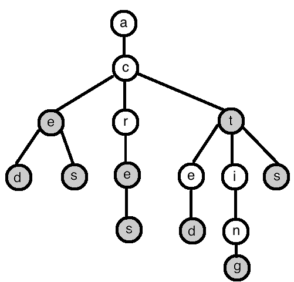

# Trie Miniproject: Trieing Wikipedia

#### Wikipedia needs autocompletion, and you're up!

### Prerequisites:

* Javascript with Prototypes
* Backbone
* Basic recursive data structures

### Setup:

`bundle install`

Then to run the ruby sinatra app:

`bundle exec ruby app.rb`

### The Root of the Matter:
Your project this weekend is to use your knowledge of recursive data structures, backbone, and javascript to make an autocompletion engine.  I've included in this repo a selection of titles of wikipedia articles.    You will write a frontend to display an input field to the user and as the user types letters, you will display to them all of the possible completions of their query.  I've set up code which will automatically retrieve the dataset specified on line 16 of `app.rb` and add it to an `Autocompleter` object in the browser.  You will also write a Trie-based backend for this `Autocompleter` object to replace the current, inefficient, array implementation.  When you're writing your Trie, you can put autocompleter.js into Trie mode by swapping the sets of lines which are commented out.

### The Trie:
A Trie is a tree which stores strings as paths through the tree.  The following trie contains the words:
`ace`, `aced`, `aces`, `acre`, `acres`, `act`, `acts`, `acted`, `acting`.

I've provided fairly comprehensive specs which you can run with `rake jasmine`.  

### Sample data sets to trie:

* `mini_titles` contains 535 lines
* `tiny_titles` contains 55635 lines
* `petite_titles` contains 200000 lines
* `small_titles` contains 744026 lines.

The full dataset, not included here, is about 70MB and 4 million lines.

## Resources:

http://en.wikipedia.org/wiki/Trie

#### Trie your best!
